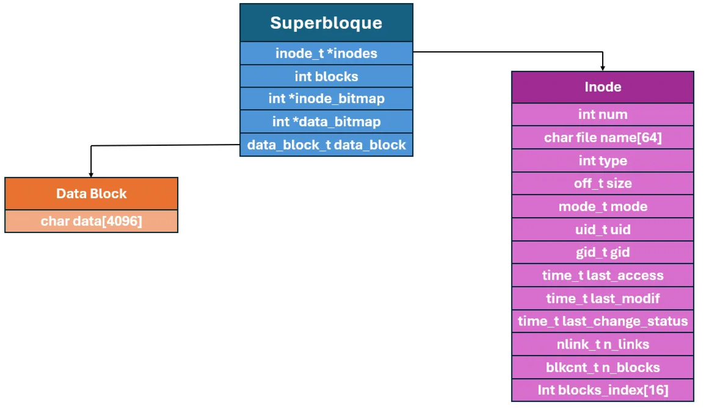
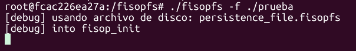

# FISOP-FS : REPRESENTACION DEL SISTEMA DE ARCHIVOS

# Estructuras de memoria
Basamos la implementacion en un Very Simple File System, en la cual el superbloque es el sistema de archivos que contiene la informacion de los inodos y bloques que se encuentran en uso, siendo los inodos la forma en la que representaremos las direcciones y archivos.

Cabe destacar que nos fue de utildad <sys/stat.h>, el encabezado de la biblioteca C POSIX para el lenguaje de programación C que contiene construcciones que facilitan la obtención de información sobre los atributos de los archivos.



## Block
Representamos los datos de los archivos en bloques de 4kb. Por ende para un sistema de 1024 bloques, definimos `BLOCK_SIZE 4096`. Trabajamos de forma proporcional entre bloques e inodos. Para ejemplificar, si elegimos 250 inodos para representar los archivos/direcciones y, en cada bloque entran 16 inodos, elegimos como cantidad de bloques 4000.  

## Superblock
Estructura que contendra:
* Puntero al array de inodos
* La cantidad total de bloques
* Puntero a los bitmap de datos e inodos en uso (o que no lo estan)
* Puntero al array donde se almacena el contenido de los archivos

Esta estructura es inicializada cuando abrimos el file system y leemos los datos persistidos de disco.

## Inode
Estructura encargada en almacenar toda la metadata. Al crearse un inodo, se le indica su tipo (si es un archivo o una direccion) determinado por `TYPE_REG o TYPE_DIR`. Ademas, se le inicializan los campos que almacenan el ID de usuario y de grupo, el tiempo de acceso, modificacion y de cambio, la cantidad de hardlinks del mismo, los permisos, etc.

## Formato de serialización del sistema de archivos en disco
**Tenemos dos maneras de indicar la persistencia en el disco:**  

- Una es la forma predetermianda en la que se utliza el archivo `persistence_file.fisopfs`:

        ./fisopfs -f ./<dir de montaje>

    En caso que no exista lo crea, sino lo carga.

- La otra es cargar un archivo propio, indicandolo seguido de --filedisk 

        ./fisopfs -f <dir de montaje> --filedisk nuevo_disco.fisopfs 

    Idem caso anterior, en caso de no existir lo crea, sino lo carga.

#### ¿Cómo funciona la persistencia en fisopfs? -> Vamos con el paso a paso

1. **Montaje inicial del filesystem**

    Cuando se ejecuta el programa, el punto de entrada es `main()`:
    
        return fuse_main(argc, argv, &operations, NULL);
    
    Esto llama a fisopfs_init() porque está registrado en struct fuse_operations.

<br>
<br>

2. **`fisopfs_init()` intenta cargar desde disco**
    
        file = fopen(filedisk, "rb");
    
    
    - Si **el archivo existe**, se intenta cargar el filesystem con:
        
            unmarshall_default_file(file);

    - Si **el archivo NO existe**, se inicializa todo desde cero con:

            init_default_fs_and_persist();

<br>
<br>

3. **Inicialización desde cero (`init_default_fs_and_persist`)**

    Este método hace dos cosas:
    
    1. Inicializa las estructuras del **superblock**:

            superblock.data_blocks = data_region_blocks;
            superblock.inodes = inodes;
            ...

    2. Marca todos los **inodos** y **bloques** como **FREE** en los **bitmaps** y **limpia** las estructuras:

            for (int i = 0; i < CANTIDAD_INODOS; i++) {
                superblock.inode_bitmap[i] = FREE;
                ...
            }

        Finalmente llama a `persist_fs_data()` para guardar el estado vacío en disco.

<br>
<br>

4. **Guardar datos a disco (`persist_fs_data`)**

    Esta función abre el archivo en modo binario (`"wb"`) y escribe en orden:

        fwrite(inode_bitmap)
        fwrite(data_bitmap)
        fwrite(inodes)
        fwrite(data_region_blocks)

    Todo queda guardado en el archivo `persistence_file.fisopfs` (o el que se pase con `--filedisk`).

<br>
<br>    

5. **Leer datos de disco (unmarshall_default_file)**

    Si el **archivo ya existía**, esta función lee en orden:

        fread(inode_bitmap)
        fread(data_bitmap)
        fread(inodes)
        fread(data_region_blocks)
    
    Y luego reconstituye el superblock apuntando a esas estructuras en memoria.

<br>
<br>

6. **Durante la ejecución: cambios en RAM**
    
    Cada vez que se **crea**, **escribe**, **borra**, etc., el sistema modifica las estructuras en **memoria RAM** (`superblock`, `inodes`, `data_blocks`, etc.).

<br>
<br>

7. **Guardar antes de desmontar: `fisopfs_destroy()`**
    
    Cuando se desmonta el filesystem (por ejemplo, al hacer `fusermount -u`), se llama a:
        
        persist_fs_data(filedisk);
    
    Que guarda el estado actual al archivo.
    
    <br>

    También se guarda el estado en cada flush() (por si se cierra un archivo):      

        fisopfs_flush() → persist_fs_data(filedisk);
    
<br>
<br>

**Resumen visual (flujo):**
    
                    main() → fuse_main() 
                                  ↓
                            fisopfs_init()
                            ↓            ↓
                         existe?     no existe
                           ↓             ↓
                     unmarshall       init_default_fs_and_persist()
                           ↓                   ↓
                    reconstrucción       persist_fs_data()
                        en RAM                 ↓
                                          archivo creado


## Muestra de persistencia en disco

### Paso 1: Inicialización del sistema de archivos



Primeramente, se inicializa el sistema de archivos `fisopfs` montándolo sobre el directorio `./prueba`.

Como no se especificó ninguna opción `--filedisk`, el sistema utiliza por defecto el archivo de persistencia llamado:

    #define DEFAULT_FILE_DISK "persistence_file.fisopfs"

Por eso, el mensaje de debug indica:

    [debug] usando archivo de disco: persistence_file.fisopfs

Luego, al no encontrar ese archivo existente, entra en la función `fisopfs_init`, donde se inicializa el filesystem desde cero llamando a `init_default_fs_and_persist()`. Esta función configura las estructuras internas (inodos, bloques, bitmaps) y guarda el estado inicial vacío en disco.

Esto queda reflejado en la consola con:

    [debug] into fisop_init

### Paso 2: Creación de directorios y archivos dentro del filesystem


Luego de haber montado el sistema de archivos en el directorio `./prueba`, se procede a crear contenido dentro de él desde otra terminal. Esto se realiza chequeando previamente que el mismo encuentre vacío,

En esta etapa se crean varios directorios en la raíz del filesystem, y dentro de cada uno se crean archivos regulares.

Internamente, estas operaciones activan funciones del filesystem como:

- `fisopfs_mkdir` para la creación de directorios.

- `fisopfs_create` para la creación de archivos.

Como resultado, se generan nuevos inodos, se asignan bloques de datos y se actualizan los bitmaps y estructuras internas en memoria.

Todos estos cambios quedan en RAM en esta instancia, listos para ser persistidos al disco cuando se realice un flush o se desmonte el filesystem.

### Paso 3: Finalización del proceso anterior e inicio con un nuevo disco de persistencia


En esta instancia, se fuerza la finalización del proceso anterior de `fisopfs`, lo que activa la función `fisopfs_destroy`. Esta función se encarga de persistir en disco todo el estado actual del `filesystem`, asegurando que los cambios (directorios, archivos, metadatos) no se pierdan.

Luego, se lanza un nuevo contenedor y se monta nuevamente el sistema de archivos, pero esta vez utilizando explícitamente el flag:

    --filedisk nuevo_disco.fisopfs

Esto indica que se desea utilizar un archivo de persistencia diferente al predeterminado, en este caso `nuevo_disco.fisopfs`.

Como no existía previamente, el sistema entra nuevamente en `fisopfs_init` y crea un `filesystem` nuevo desde cero, utilizando ese archivo como base para la persistencia.

Esta lógica permite tener múltiples instancias de filesystems independientes, cada una con su propio archivo persistente.

### Paso 4: Creación de contenido en el nuevo filesystem


Con el nuevo archivo de persistencia (`nuevo_disco.fisopfs`) ya inicializado, se accede nuevamente al punto de montaje y se crean nuevos directorios dentro del `filesystem`. Chequeando nuevamente que el mismo se encuentre vacío.

Esto confirma que el nuevo `FS` funciona de forma independiente del anterior, permitiendo mantener múltiples sistemas de archivos persistentes y aislados entre sí.

### Paso 5: Recarga del filesystem original desde disco


Finalmente, se vuelve a iniciar fisopfs montándolo nuevamente sobre el directorio `./prueba`, esta vez sin especificar un archivo de persistencia, por lo que se utiliza nuevamente el archivo por defecto: `persistence_file.fisopfs`

Como este archivo ya había sido creado y persistido previamente, el sistema entra a la función `fisopfs_init` y, al encontrarlo existente, carga su contenido en memoria mediante `unmarshall_default_file()`.

Esto permite restaurar completamente el estado del filesystem tal como estaba antes del cierre, incluyendo los directorios y archivos previamente creados.

### Paso 6: Verificación de la persistencia en original


Como paso final, se accede nuevamente al punto de montaje (./prueba) y se recorre el sistema de archivos.

Se comprueba que los directorios y archivos creados en ejecuciones anteriores del filesystem (como `file1`, `file2`, `file3` y sus respectivos archivos `hola`, `hola2`, `hola3`) siguen presentes, confirmando que la persistencia en disco funciona correctamente.

Esto demuestra que los datos fueron guardados en el archivo `persistence_file.fisopfs` y restaurados exitosamente al volver a montar el sistema.

### Paso 7: Remonte del disco personalizado


Como agregado, se vuelve a iniciar el sistema de archivos, esta vez utilizando nuevamente el archivo de persistencia personalizado (`nuevo_disco.fisopfs`), montándolo sobre el mismo punto (`./prueba`).

Al existir el archivo, el sistema entra en `fisopfs_init`, detecta el archivo previamente persistido y carga su estado en memoria.

### Paso 8: Verificación de contenido persistente en el nuevo disco


Al acceder al punto de montaje y listar el contenido, se verifica que los directorios previamente creados (`file4`, `file5`, `file6`) siguen existiendo, confirmando que el segundo disco de persistencia también mantiene correctamente su estado entre ejecuciones.

Esto demuestra que el sistema permite trabajar con múltiples archivos de persistencia independientes, restaurando correctamente el contenido correspondiente a cada uno.


## ¿Cómo el sistema de archivos encuentra un archivo específico dado un path?

¿Cómo busca un path el sistema? 

1. **El punto de entrada: `get_inode_from_path()`**

        int get_inode_from_path(const char *path)

    Esta función recorre todos los **inodos** del filesystem buscando uno cuyo **file_name** coincida exactamente con **path**.

<br>
<br>

2. **¿Cómo lo hace?**

        for (int i = 0; i < CANTIDAD_INODOS; i++) {
            if (superblock.inode_bitmap[i] == USED &&
                strcmp(superblock.inodes[i].file_name, path) == 0) {
                return i; // inodo encontrado
            }
        }

    - Verifica que el inodo **esté en uso** (USED)

    - Compara el **path del inodo** con el **path buscado** (match exacto)

    - Si lo **encuentra**, devuelve el **índice del inodo**

<br>
<br>

3. ¿Dónde se usa esta función?
    
    En `read()`, `write()`, `getattr()`, `unlink()`, `truncate()`, etc.

    Ejemplo:

        int inode_index = get_inode_from_path(path);
        if (inode_index < 0) return -ENOENT; // No existe
        struct inode *ino = &superblock.inodes[inode_index];

<br>
<br>

**Consideraciones importantes**

- El sistema guarda los paths completos en `inode->file_name`. Ejemplo: `"/docs/texto.txt"`

- Por eso, la comparación en `get_inode_from_path()` es directa con `strcmp()`.

- No se hace **parsing del path** como en otros FS que recorren jerárquicamente; acá se usa una lista plana de inodos con paths absolutos.

## Funciones Auxiliares

**`liberar_bloque`** 

-Recibe un entero bloque_idx, que representa el índice de un bloque de datos a liberar. Verifica que el índice esté dentro de los límites válidos

-No devuelve ningún valor 

**`get_inode_from_path`**

-Recibe un puntero a char llamado path, que representa el nombre o ruta del archivo o directorio a buscar.

-Devuelve el índice del inodo correspondiente si lo encuentra, o -1 si no se encuentra ningún inodo con ese nombre.

**`get_free_block_i`**

-No recibe parámetros

-Devuelve el índice del primer bloque libre encontrado, o -1 si no hay bloques libres disponibles.

**`get_free_inode_i`**

-No recibe parámetros

-Devuelve el índice del primer inodo libre encontrado, o -1 si no hay inodos libres disponibles.

**`get_free_block_for_inode`**

-Recibe inode_index es un número que identifica de forma única un archivo o directorio y tambien recibe pos_offset que indica la posición específica dentro de ese archivo donde se almacenará el nuevo bloque de datos

-Devuelve 0 si todo salió bien y se pudo asignar un bloque de almacenamiento libre al archivo o ENOMEM si no hay bloques de almacenamiento libres disponibles en el sistema

**`is_direct_child_of_root`**

-Recibe el path que representa la ubicacion de un archivo o carpeta

-Devuelve True si la path se refiere a algo que está directamente en el directorio raíz o False si la path no está directamente en la raíz

**`get_last_dentry`**

-Recibe el path que representa la ubicacion de un archivo o carpeta

-Devuelve un número entero que representa el índice de la última /, este número te dice dónde aparece el último carácter de barra en la path

**`is_in_dir`**

-Recibe una cadena de texto que representa la ruta del directorio que queremos comprobar si contiene el otro elemento y una cadena de texto que representa la ruta del archivo o carpeta que estamos buscando

-Devuelve 1 si es verdadero y 0 si es falso

## TESTS
A continuacion explicaremos el paso a paso para correrlos. Haremos uso de dos terminales. 

* En la primera ejecutaremos:

```
$ ./mount.sh
```

Monta el filesystem en la carpeta testsdir

* En la segunda terminal se debe ejecutar:

```
$ ./fisopfs_tests.sh
```
Corre y muestra por terminal todos los tests con las funcionalidades pedidas del filesystem

#### Tests para persistencia LUEGO de correr los tests anteriores:
###

* En la primer terminal se debe ejecutar:

```
$ ./mount.sh -p
```

Monta el filesystem la carpeta testsdir y levanta el archivo que persiste los datos

* En la segunda terminal se debe ejecutar:
```
$ ./fisopfs_tests.sh -p
```
Corre y muestra por terminal que los datos de la anterior corrida siguen estando. Fueron agregados datos para este test en particular.

